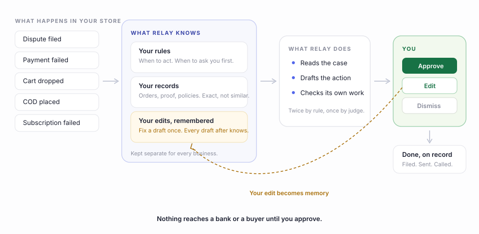

# Introducing Relay: AI teammates that run SMB payment operations

*What follows is the launch, told from the inside of one abandoned
cart.*

The cart dies at 4:47 pm on a Tuesday. A buyer spent 11 minutes
choosing, got to the UPI screen, and then the OTP came late, or the
doorbell rang, or the app switched and never switched back. ₹2,000 of
decided intent, sitting in a cart, cooling.

Here is the uncomfortable physics of that moment: the intent decays by
the hour. Call that buyer in 10 minutes and they mostly still want the
thing. Tomorrow morning they have talked themselves out of it, or
bought it somewhere else. Most merchants meet their dropped carts as a
number in a dashboard the next day, which is a polite way of saying
they meet them at the funeral.

Nobody calls, because nobody can. On Cashfree's data, 7 in 10 Indian
SMBs run payment operations entirely by hand, and the average SMB
spends 60 hours a week on it. A 5 person company does not have a
person to put on 400 dropped carts, plus the failed payments, the COD
confirmations, the subscription saves, the dispute deadlines. The
work happens badly, or the founder does it at midnight, which is the
same thing with worse sleep.

This is the job Relay was built to take. Not to flag. To finish.

## What Relay is

Relay is an AI teammate that runs payment operations for SMBs. It
reads the merchant's own transaction records and completes the work:
calls the dropped cart while the intent that built it is still alive,
retries the failed payment, confirms the COD order, saves the failing
subscription, screens the refund claim, files the dispute. It owns
the outcome, not the task: it tracks whether the cart actually came
back, and decides what to try next when it did not. A merchant sets
it up by describing the outcome in plain language. There is no
workflow canvas and no node editor, because the merchant we built
this for will never open one.

It asks permission at exactly 2 moments: before a payment moves and
before a customer is contacted. Everything else it does quietly and
writes down.

One more thing it is not: a catalog. Every Relay agent is first-party
and runs on the same engine, the same ledger, the same gate. There is
no marketplace of rebadged vendors underneath, because agents that
share nothing can teach each other nothing.

Relay launched this week for all Cashfree merchants, free at launch,
after running in beta since May. That is the announcement. What
follows is the part a press release cannot hold: how it actually
works, walked through the agent every store needs first.

## One agent, all the way down

Relay is a superagent: one teammate at the surface, specialist agents
underneath. We could describe all of them at the same shallow depth.
More useful to take Abandoned Cart Recovery and cut it open. The rest
of the team follows the same anatomy, and we will meet them before
the end.

Back to Tuesday, 4:47 pm.

Detection is not AI. A payment initiated and not completed within the
window is a fact, and facts get a lookup, not an inference. The
engine opens a run in a ledger that only ever grows, and reads the
record: what was in the cart, what the buyer paid with last time,
whether this was an OTP failure or a plain walk-away, what the
pincode's history says about when people answer their phones.

Then it drafts the move. Not a blast. A reason-specific nudge: an OTP
failure gets a fresh payment link with an apology for the bank's
manners; a walk-away gets a call at the hour this buyer actually
answers, with the link dropped into the same WhatsApp thread
mid-conversation. The draft is checked before anyone sees it, against
rules with no model in them: quiet hours, attempt caps, opt-outs
honoured forever, no discounts unless you allowed one.

Then it stops. The evening's rescue list, every buyer, every message,
every planned call, lands in front of you as 1 card. You approve the
list once. Then the calls go, the links land, and every outcome is
written back: recovered, rescheduled, said stop, said nothing.

The next morning you read what your teammate did, not what it wants
you to do.

> **See your own operations run like this.** Relay is rolling out to
> Cashfree merchants now. **[Get Early Access](#)**
> <!-- CTA link: replace # in CMS -->

## The context engine

The model is not the interesting part. What the model reads is.

Underneath every agent sit 3 tiers of context, kept in our own
database and isolated per merchant down to the row.

**Policy.** What this merchant allows: calling windows, attempt caps,
discount rules, when to ask a human. Configuration in rows, so
changing behaviour is an update, not a deploy.

**Records.** The facts an action may use: this order, this buyer's
payment history, this pincode's answer rate. Retrieval is exact
match. No RAG, no embeddings, deliberately. RAG is right when an
agent answers from a help centre, where the nearest article is
usually good enough. An action that touches a real buyer needs this
buyer's record, and there is no such thing as a semantically similar
customer.

**Learned preference memory.** The tier we are proudest of, because
it closes a loop most AI products leave open. When you edit what the
agent drafted before approving it, the engine diffs the draft against
your edit, writes the lesson as a memory note, and reads it back
before the next draft. Rewrite one nudge to lead with the delivery
date instead of the discount, and every nudge after arrives already
knowing. Your corrections are not feedback forms. They are the
training set.

Memory is scoped per merchant: one brand's hard won phrasing never
leaks into another's drafts. The isolation that guards the record
guards the lessons.

## The trust machine

Consider what stands between a mistake and a customer today: nothing.
Whether the work is done by hand or by a tool that auto-dials, the
call is already made before anyone reviews it. "Autonomous" is the
favourite adjective in agent launches this year, and it names exactly
that gap. Relay's tagline is "you approve before anything sends".
Taglines are cheap too. Here is the machinery.

First, deterministic checks with no model in them: quiet hours,
attempt caps, opt-outs, banned promises. Then an LLM judge scores the
draft; below threshold it never surfaces. What passes waits for you:
approve, edit, dismiss. Anything that fails, stalls, or looks unusual
escalates to an internal review channel, staffed by us, invisible to
your customer. And every action carries its own fingerprint, so a
retry cannot double-send and a decision is written exactly once. The
record only ever grows. Nobody edits history, including us.

Notice what the gate really is. Every edit you make there feeds the
memory tier. Most products treat approval as friction to be
engineered away; Relay treats it as the training signal. The human in
the loop is the learning loop, which is why the gate gets better at
staying out of your way the more you use it.

## The proof

Claims about agent architecture are cheap this year, so here is ours
with a receipt. We proved this anatomy first on the hardest workflow
we own, disputes, where a missed deadline is not a lost sale but a
debit. The full path runs end to end in our test suite: bank webhook
to drafted, evidence-cited reply to human gate to filed response,
including the memory loop. This is the engine's own trace of one run:

    16:47:12  detection-agent    signal     bank webhook · dispute filed
    16:47:12  detection-agent    confirmed  charged twice for the same order
    16:47:13  eligibility-agent  qualified  all safety checks passed
    16:47:19  response-agent     drafted    2 citations
    16:47:21  compliance-agent   passed     checks + judge clean
    16:47:22  gate               surfaced   card sent to the merchant

10 seconds from webhook to a gated draft. And the learning loop is
pinned by a single test whose name is the whole story:

    test_edit_runs_the_diff_writes_memory_and_next_draft_reads_it

"It gets smarter from your edits" is a sentence every AI product
says. Ours compiles.

## The rest of the team

Same records, same approval moments, same lessons written back. Here
is what the rest of the team does with the anatomy you just read.

**Failed Payment Recovery** reads the decline code before it acts. A
bank timeout gets a retry in minutes; an insufficient-balance decline
waits for the morning; every buyer gets a fresh link instead of an
apology. A failed payment is not a lost order. It is an order that
needs 1 more attempt, made intelligently.

**COD Confirmation** calls before dispatch, because a COD order
confirmed is a return prevented. It carries the pincode's history
into every decision, offers prepaid where the risk says to, and holds
only what you approve holding.

**Subscription Dunning** treats a failed mandate as a customer about
to quietly leave. Reason-aware retries, a nudge before the grace
window closes, an alternate payment method when the pattern says the
card is the problem. Saved subscriptions, not chased ones.

**Refunds** get looked at before they get paid. Most claims are
honest and clear in seconds; the ones that repeat a photo, an
address, or a pattern wait for your eyes instead of your wallet.
Checking every claim by hand costs more than the fraud, so today
nobody checks. Relay checks.

**Dispute Defender** gathers the proof, writes the reply, and files
it before the bank's deadline. You met its insides in the proof
section above: it is the agent we tested hardest, because it is the
one where being wrong costs the most.

6 agents, 1 engine. When the COD agent learns that a pincode answers
after 6 pm, the cart agent calling that same buyer already knows. The
team shares a memory the way a good 5 person team does: without
meetings.

## The honest ledger

Beta since May means merchants have been running Relay's turnkey
agents on real operations. The dispute engine shown in the proof
section is proven against simulated rails: the full path, including
the memory loop, runs green in the suite on the same database schema
production uses, but it does not yet have a live bank webhook feeding
it production disputes. The numbers in this post come from Cashfree's
merchant data and from a test suite, and we have said which is which.
We would rather do that than let a paragraph imply more than exists.

## Why this needed a payments company

An agent is only as good as the records under it. Relay runs on
Cashfree's own infrastructure and is grounded in the merchant's
actual transaction data: orders, settlements, refunds, disputes, the
decline codes and the delivery scans. Its agents arrive pre-trained
on payment operations patterns, which is why a turnkey agent is
useful on its first day instead of after a month of tuning. And there
is a containment argument as plain as the capability one: a stack of
point tools means your payments data scattered across a myriad of
vendors, each holding its own copy. With Relay it stays in one place.
Merchant transaction data is not sent to external AI providers.

A horizontal AI tool can draft you a very charming recovery message.
It has never seen your order, cannot send the payment link, and will
not make the call. The draft was never the hard part. And making AI
pay for itself is engineering work: prompt tuning, feedback loops,
model and token optimisation, none of it a merchant's job. In Relay
that work arrives already done. The feedback loop you would otherwise
have to build is the memory tier, running on every edit.

## Keep the hours, and the revenue

The aim is blunt: from 60 hours a week of payment operations to under
45 minutes of approvals. And the hours are only half of it. Every
follow-up Relay closes, the recovered cart, the retried payment, the
dispute answered in time, is revenue on top of what you already make,
from demand you already paid to create.

If you run on Cashfree, Relay is on your dashboard today. Describe
the job you would have hired for. Approve what it drafts. Edit it
once, and watch the next draft arrive already knowing. Do more, and
grow more.

**[Get Early Access](#)** <!-- CTA link: replace # in CMS -->

Tuesday, 4:47 pm will keep happening. The cart will still drop. It
just will not stay dropped.
